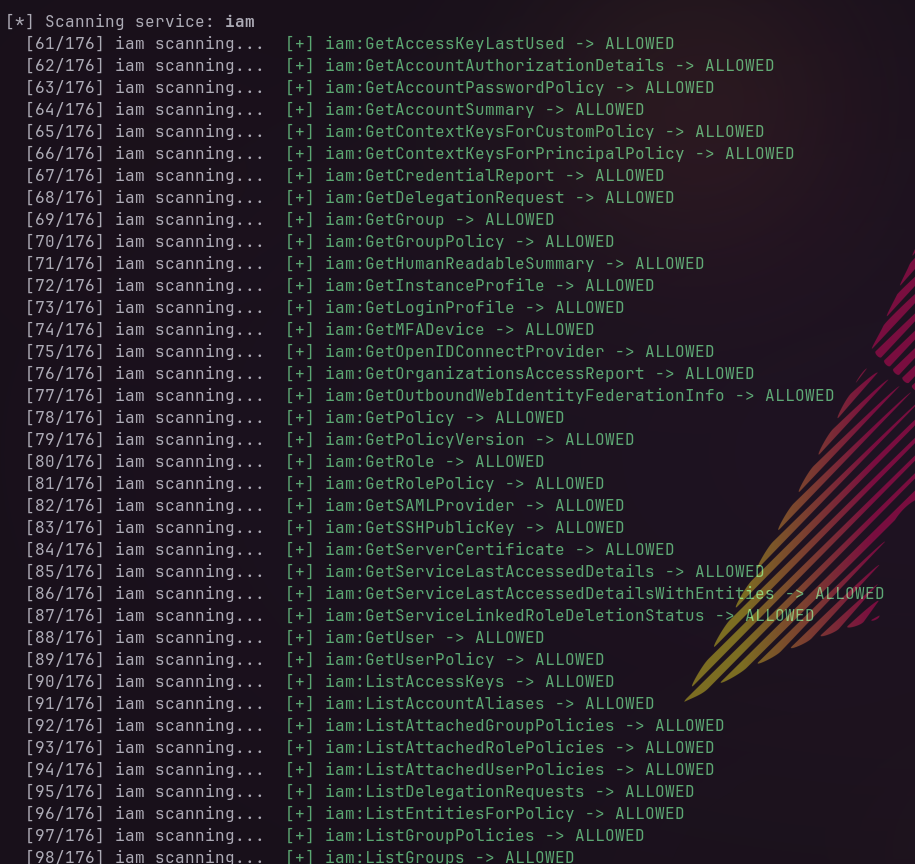
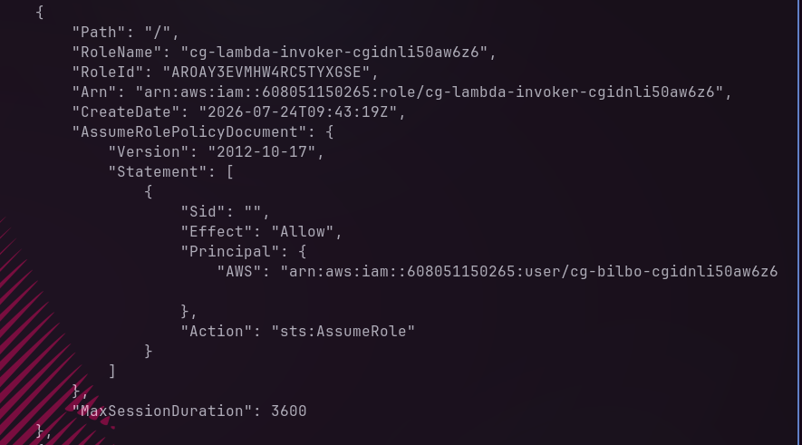
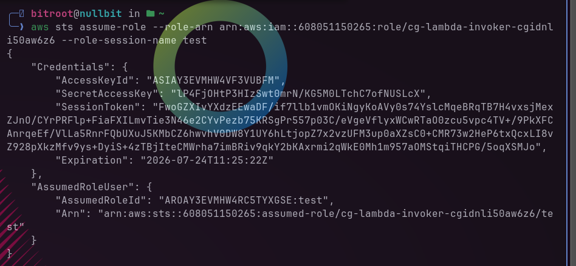

In this scenario we are provided with a user creds.
Using a tool called shadowperms I found that this user have permission to use a lot of iam modules and only 2 sts modules nothing else.

Checking the roles. I found a role that allows the user to assume it 

It gave us temporary creds to use this role.

I found a lambda function that allows to set a policy for a user validated against a db.

Getting that function provided a link that automatically downloads a zip file.

The downloaded file was the lambda function source code.

Checking the main python script I found interesting things

In this script. We can see the available policies one of them is adiministrator_access publi is set to false and the others are set to true.
However, in this section the script will get a policy from the list and has public "true" and assign it to the user. But the for function uses the statement variable without sanitization meaning we can use SQL injection vulnerabitlity to use the adiministration_access.

But before that I checked the db but found only the policies

I used SQL injection while invoking the lambda funciton which resulted in giving admin privs to user bilbo
![[10_payload.png]]

As shown here no bilbo can use much more services
![[12_shadowperms_admin.png]]
Since we have more power now. I checked some services like secretsmanager and found one!
![[13_secret_found.png]]
And in that secret I found the flag value.
![[14_flag_value.png]]
